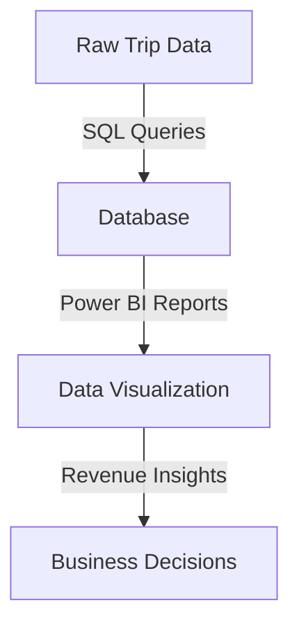
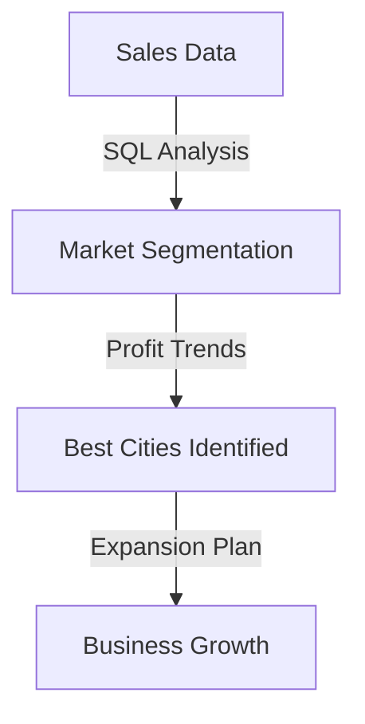
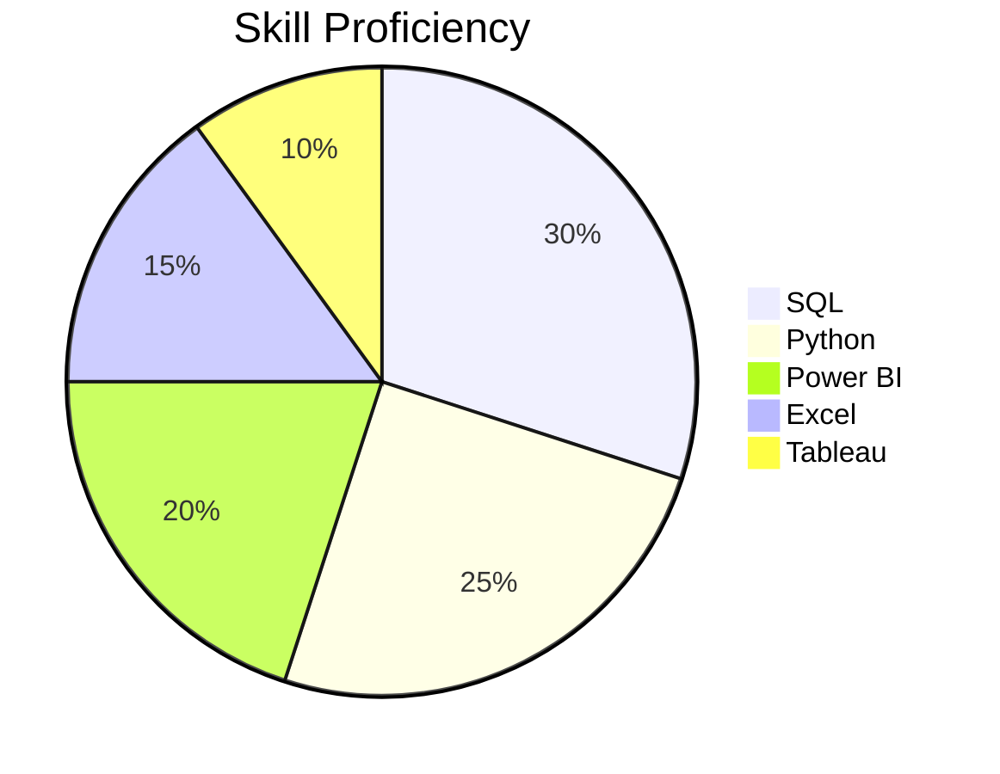

### Hi there! I'm Subhrajyouti Mahanta 

🚀 **Aspiring Data Analyst | SQL | Power BI | Python | Data Visualization**

Welcome to my GitHub! I'm passionate about transforming raw data into actionable insights through data analytics, visualization, and business intelligence. With a background in data analysis and experience working with large datasets, I thrive on solving complex data challenges.

---

## 📫 Connect with Me

| 📩 Email | 💼 LinkedIn | 🏗 GitHub |
|----------|------------|-----------|
| [subhrajyoutimahanta@gmail.com](mailto:subhrajyoutimahanta@gmail.com) | [LinkedIn](https://linkedin.com/in/subhrajyotimahanta) | [GitHub](https://github.com/Subhrajyouti) |

---

## 🏆 Projects

### 🚖 GoodCabs Performance Analysis *(SQL & Power BI)*
📌 **Tech Stack:** Power BI, PostgreSQL, SQL, Data Visualization  
📌 **Overview:** Analyzed 500,000+ trip records, built a Power BI dashboard, and optimized revenue tracking.  
📌 **Insights:** Identified that repeat passengers contribute **40%+ more revenue** per trip.  
📌 **GitHub Repo:** [GoodCabs Analysis](#)

📊 **Diagram:**

---

### 📊 Data Analyst Job Market Insights *(Python & Excel)*
📌 **Tech Stack:** Python, Pandas, Seaborn, Matplotlib, Jupyter Notebook, Excel  
📌 **Overview:** Analyzed 10,000+ job postings to uncover salary trends and in-demand skills.  
📌 **Insights:** SQL appeared in **50%+** of job postings, Python in **72%** of Data Scientist roles.  
📌 **GitHub Repo:** [Job Market Research](https://github.com/Subhrajyouti/Data-Science-Job-Market-Research-with-Python)

📊 **Diagram:**

---

### ☕ SQL-Based Market Expansion Analysis *(Monday Coffee Project)*
📌 **Tech Stack:** SQL, Data Cleaning, Decision Optimization, Market Expansion Strategy  
📌 **Overview:** Analyzed 100,000+ sales records to determine optimal city expansion strategy.  
📌 **Insights:** Identified **Pune, Delhi, and Chennai** as best expansion locations.  
📌 **GitHub Repo:** [Monday Coffee Expansion](https://github.com/Subhrajyouti/Monday_cofee_sales_store_expansion)

📊 **Diagram:**

---

## 🔧 Skills

📌 **Languages:** SQL, Python, R  
📌 **Databases:** PostgreSQL, SQLite, MySQL  
📌 **Tools & Frameworks:** Power BI, Tableau, MS Excel, Pandas, NumPy, SciPy, Matplotlib  

📊 **Skill Set Overview:**

---

## 🎓 Certifications
✅ SQL for Data Analytics  
✅ Python for Data Analytics  
✅ Excel for Data Analytics  

---

📌 *Open to collaboration, job opportunities, and projects in data analytics and business intelligence!* 🚀
